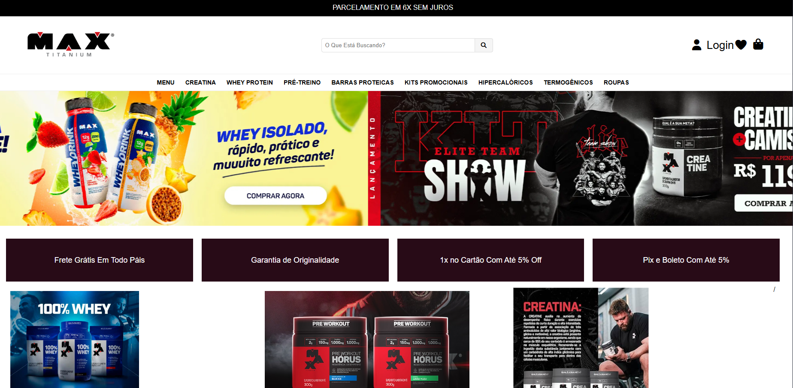
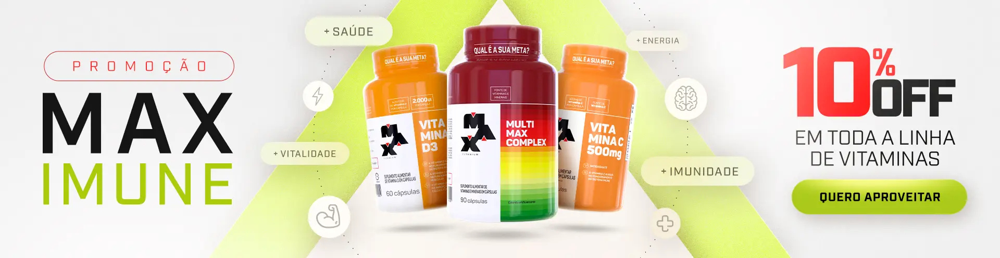
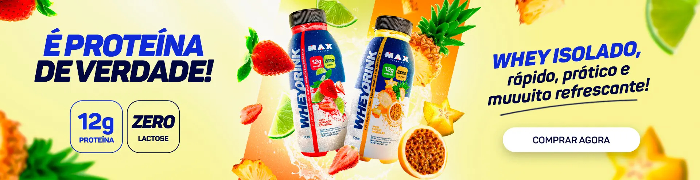
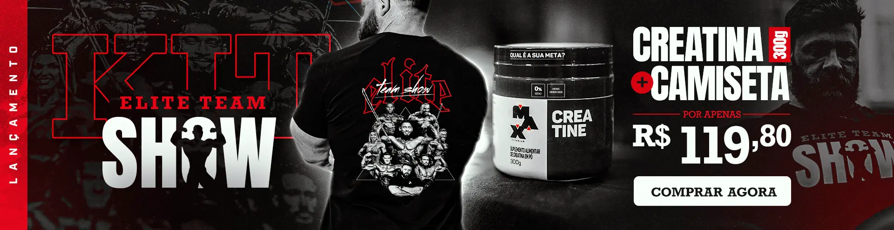

# 🏋️ Max Titanium — Site Corporativo de Suplementos

<p align="center">
  
  
  
  
  
  
  <br>
  
  
  
  
  
  
</p>

---

## O que é o Site Max Titanium?

O **Site Max Titanium** é um portal corporativo de página única desenvolvido para uma das maiores marcas de suplementos alimentares do Brasil. O projeto destaca-se pelo **design profissional 100% em CSS puro** — sem qualquer framework, JavaScript ou dependências pesadas para a lógica principal.

O site foi selecionado como **projeto de destaque** pela qualidade visual e técnica, demonstrando domínio avançado de HTML5 semântico, CSS3 com animações, variáveis customizadas, carrossel automático em CSS puro e responsividade completa em 3 breakpoints.

**Zero JavaScript. Zero frameworks. CSS puro a brilhar.**

---

## O que entrega?

### Para o visitante do site
- **Navegação intuitiva** — menu horizontal com 4 links (HOME, PRODUTOS, SOBRE NÓS, CONTATO)
- **Header promocional** — faixa preta com mensagem de parcelamento e desconto
- **Carrossel automático** — 3 slides com transições suaves (9 segundos por ciclo)
- **Catálogo de produtos** — 4 cards com imagem e descrição (Creatina, Whey, Pré-Treino, Termogénico)
- **Seção de vantagens** — 4 cards (Frete Grátis, Pagamento Seguro, Qualidade Garantida, Suporte 24h)
- **Produtos em destaque** — 3 cards adicionais com layout diferenciado
- **Footer completo** — 4 colunas + logo vertical
- **Design responsivo** — adapta-se a desktop, tablet e mobile

### Para o developer / designer
- **Carrossel em CSS puro** — animação `@keyframes` com `translateX`, sem uma linha de JavaScript
- **Sistema de design documentado** — paleta de cores, tipografia, variáveis CSS
- **HTML5 semântico** — `header`, `nav`, `main`, `section`, `footer`
- **CSS Custom Properties** — variáveis para cores e tema
- **Animações e micro-interações** — `transform: translateY()` em hover, `transition` suave
- **3 breakpoints documentados** — desktop (>768px), tablet (≤768px), mobile (≤576px/480px)
- **Font Awesome + Google Fonts** — ícones vetoriais e tipografia Poppins
- **14 imagens otimizadas** — produtos, logos, slides do carrossel

### Para o recrutador / avaliador
- **Domínio de CSS avançado** — carrossel, animações, variáveis, flexbox, grid, media queries
- **Design profissional** — paleta corporativa, hierarquia visual, consistência
- **Criatividade técnica** — carrossel em CSS puro é raro e demonstra conhecimento profundo
- **Atenção ao detalhe** — 14 imagens selecionadas, favicon, logos em formatos diferentes
- **Código limpo** — 169 linhas HTML + 239 linhas CSS, semântico e bem estruturado

---

## Arquitectura HTML

A página segue uma estrutura semântica rigorosa:

```html
<body>
  <header>                    <!-- Faixa preta promocional -->
  <nav>                       <!-- Menu de navegação principal -->
  <main>
    <section class="slider">  <!-- Carrossel de 3 slides -->
    <section class="cards">   <!-- Cards de produtos (4) -->
    <section class="vantagens"><!-- 4 cards de vantagens -->
    <div class="produtos">    <!-- Catálogo expandido -->
    <section class="lojas">   <!-- Produtos em destaque (3) -->
  </main>
  <footer>                    <!-- 4 colunas + logo -->
</body>
```

### Header Promocional
Faixa preta no topo com a mensagem: **"PARCELAMENTO EM 6X SEM JUROS + 10% DE DESCONTO NO PIX"**

### Navegação Principal
Menu horizontal com 4 links: **HOME**, **PRODUTOS**, **SOBRE NÓS**, **CONTATO** + logo horizontal (`logodeitada.png`)

---

## Estrutura de Ficheiros

```
SiteMaxtitanium/
├── index.html              (169 linhas) — Página principal completa
├── style.css               (239 linhas) — Todo o CSS do site
├── print1.png              Screenshot do site
├── README.md               Esta documentação
└── img/
    ├── 1.png, 2.png, 3.png           Slides do carrossel
    ├── creatina1.jpg, creatina2.jpg  Imagens de creatina
    ├── whey2.jpg                     Imagem de whey protein
    ├── pretreino1.jpg, pretreino2.jpg Imagens de pré-treino
    ├── termogenico.png               Imagem de termogénico
    ├── barra de proteina.jpg         Imagem de barra proteica
    ├── logodeitada.png               Logo horizontal (header)
    ├── logoempe.png                  Logo vertical (footer)
    └── icon/
        └── icon.png                  Favicon do site
```

---

## 📸 Demonstração Visual



---

## 🎠 Carrossel — Mecanismo CSS Puro

O carrossel utiliza **apenas CSS** (sem JavaScript) para transição automática entre 3 slides. Esta é a funcionalidade mais impressionante do ponto de vista técnico.

### Estrutura HTML
```html
<div class="slider">
  <div class="slides">
    <div class="slide"></div>
    <div class="slide"></div>
    <div class="slide"></div>
  </div>
</div>
```

### Animação CSS
```css
.slides {
  display: flex;
  width: 300%;         /* 3 slides = 300% */
  animation: slide 9s infinite;
}

@keyframes slide {
  0%, 28%   { transform: translateX(0); }
  33%, 61%  { transform: translateX(-33.33%); }
  66%, 94%  { transform: translateX(-66.66%); }
  100%      { transform: translateX(0); }
}
```

Cada slide fica visível por aproximadamente 3 segundos (33% de 9s). O `overflow: hidden` no `.slider` esconde os slides fora da viewport.

---

## 🎨 Sistema de Design CSS

### Paleta de Cores Corporativa

| Cor | Hex | Uso |
|-----|-----|-----|
| Preto | `#000000` | Header, footer, textos principais |
| Cinza Escuro | `#1a1a1a` | Fundo das seções |
| Branco | `#ffffff` | Textos sobre fundo escuro |
| Vermelho | `#e63946` | Destaques, hover, botões |
| Dourado | `#f4a261` | Detalhes premium |
| Cinza Claro | `#f5f5f5` | Fundo de cards |

### CSS Custom Properties

```css
:root {
  --primary-color: #e63946;
  --dark-bg: #1a1a1a;
  --light-bg: #f5f5f5;
  --text-light: #ffffff;
  --text-dark: #333333;
  --accent-gold: #f4a261;
}
```

### Tipografia

O site utiliza a fonte **Poppins** via Google Fonts, com pesos 300, 400, 600 e 700 para hierarquia visual:

```css
@import url('https://fonts.googleapis.com/css2?family=Poppins:wght@300;400;600;700&display=swap');

body {
  font-family: 'Poppins', sans-serif;
}
```

### Animações e Transições

```css
/* Hover nos cards de produto */
.card:hover {
  transform: translateY(-10px);
  box-shadow: 0 15px 30px rgba(0,0,0,0.3);
  transition: all 0.3s ease;
}

/* Hover nos links do menu */
nav a:hover {
  color: var(--primary-color);
  border-bottom: 2px solid var(--primary-color);
  transition: all 0.2s ease;
}
```

---

## 🛍️ Catálogo de Produtos

### Cards de Produtos (4 cards)

| Produto | Imagem | Descrição |
|---------|--------|-----------|
| **Creatina** | `creatina1.jpg` / `creatina2.jpg` | Aumento de força e performance |
| **Whey Protein** | `whey2.jpg` | Proteína de alta qualidade |
| **Pré-Treino** | `pretreino1.jpg` / `pretreino2.jpg` | Energia e foco para o treino |
| **Termogénico** | `termogenico.png` | Aceleração do metabolismo |

### Seção de Vantagens (4 cards)

| Vantagem | Ícone |
|----------|-------|
| **Frete Grátis** | Font Awesome: `fa-truck` |
| **Pagamento Seguro** | Font Awesome: `fa-lock` |
| **Qualidade Garantida** | Font Awesome: `fa-shield` |
| **Suporte 24h** | Font Awesome: `fa-headset` |

### Produtos em Destaque (3 cards)
- Barra de Proteína
- Creatina (destaque repetido com layout diferente)
- Whey Protein (destaque repetido com layout diferente)

---

## 📱 Responsividade

O site adapta-se a **3 breakpoints** com media queries:

### Desktop (> 768px)
- Layout completo com todas as seções
- Cards em grid de 4 colunas
- Carrossel em tela cheia
- Navegação horizontal completa

### Tablet (≤ 768px)
- Cards reduzem para 2 colunas
- Menu mantém-se horizontal
- Carrossel ajusta altura proporcionalmente
- Seções com padding reduzido

### Mobile (≤ 576px / 480px)
- Cards em coluna única
- Carrossel ocupa largura total
- Fontes reduzidas para legibilidade
- Footer empilha colunas verticalmente

---

## Stack Tecnológica

| Camada | Tecnologia | Uso |
|--------|-----------|-----|
| Estrutura | HTML5 | Tags semânticas, meta viewport, SEO básico |
| Estilo | CSS3 | Variáveis, flexbox, grid, animações `@keyframes`, media queries |
| Ícones | Font Awesome 7.0.0 | CDN, ícones vetoriais escaláveis |
| Fontes | Google Fonts (Poppins) | Pesos 300, 400, 600, 700 |
| Imagens | 14 imagens JPG/PNG | Produtos, logos, slides do carrossel |
| Editor | VS Code | Desenvolvimento |

---

## Métricas do Projecto

| Métrica | Valor |
|---------|-------|
| Linhas HTML | 169 |
| Linhas CSS | 239 |
| Total de linhas | 408 |
| Imagens | 14 (JPG/PNG) |
| Seções HTML | 7 (header, nav, slider, cards, vantagens, produtos, footer) |
| Breakpoints | 3 (desktop, tablet, mobile) |
| Slides do carrossel | 3 |
| Produtos no catálogo | 4 principais + 3 destaques |
| Vantagens | 4 cards com ícones |
| Cores na paleta | 6 |
| Dependências externas | 2 (Font Awesome CDN, Google Fonts) |
| JavaScript | **0 linhas** |

---

## Como Executar

```bash
# 1. Clone o repositório
git clone https://github.com/Breno-J-Oliveira/SiteMaxtitanium.git

# 2. Acessa a pasta
cd SiteMaxtitanium

# 3. Abre no navegador
start index.html
# ou
open index.html
```

Nenhuma dependência ou build necessário — é HTML + CSS puro. Abre e funciona.

---

> O Site Max Titanium é a prova de que CSS puro, quando bem dominado, dispensa JavaScript para criar experiências visuais profissionais. O carrossel animado, os hovers, as transições — tudo feito apenas com folhas de estilo.

---

## Roadmap — O que vem a seguir?

| Meta | Estado |
|------|--------|
| Estrutura HTML5 semântica | ✅ Concluído |
| Carrossel CSS puro (`@keyframes`) | ✅ Concluído |
| Sistema de design (paleta, tipografia, variáveis) | ✅ Concluído |
| Cards com animações hover | ✅ Concluído |
| Responsividade 3 breakpoints | ✅ Concluído |
| Font Awesome + Google Fonts | ✅ Concluído |
| Modo escuro (CSS custom properties) | 🔜 Planeado |
| Carrossel com navegação manual (botões/dots) | 🔜 Planeado |
| Página de produto individual | 🔜 Planeado |
| Formulário de contacto funcional | 🔜 Planeado |
| Integração com backend PHP/Node.js | 🔜 Planeado |
| Deploy em produção (Netlify/Vercel) | 🔜 Planeado |

---

## 👤 Contatos e Redes Sociais

<p align="center">
  <a href="https://github.com/Breno-J-Oliveira" target="_blank">
    
  </a>
  <a href="https://www.linkedin.com/in/breno-j-oliveira-672619352/" target="_blank">
    
  </a>
  <a href="https://www.instagram.com/brenoov" target="_blank">
    
  </a>
  <a href="https://x.com/BrenoJOliveira_" target="_blank">
    
  </a>
</p>

---

<p align="center">
  <strong>🏋️ Site Corporativo — 408 linhas · 0 JS · 14 imagens · Carrossel CSS Puro</strong><br>
  <em>Desenvolvido com 💛 por Breno Oliveira — Técnico em Desenvolvimento de Sistemas | SENAI</em>
</p>
